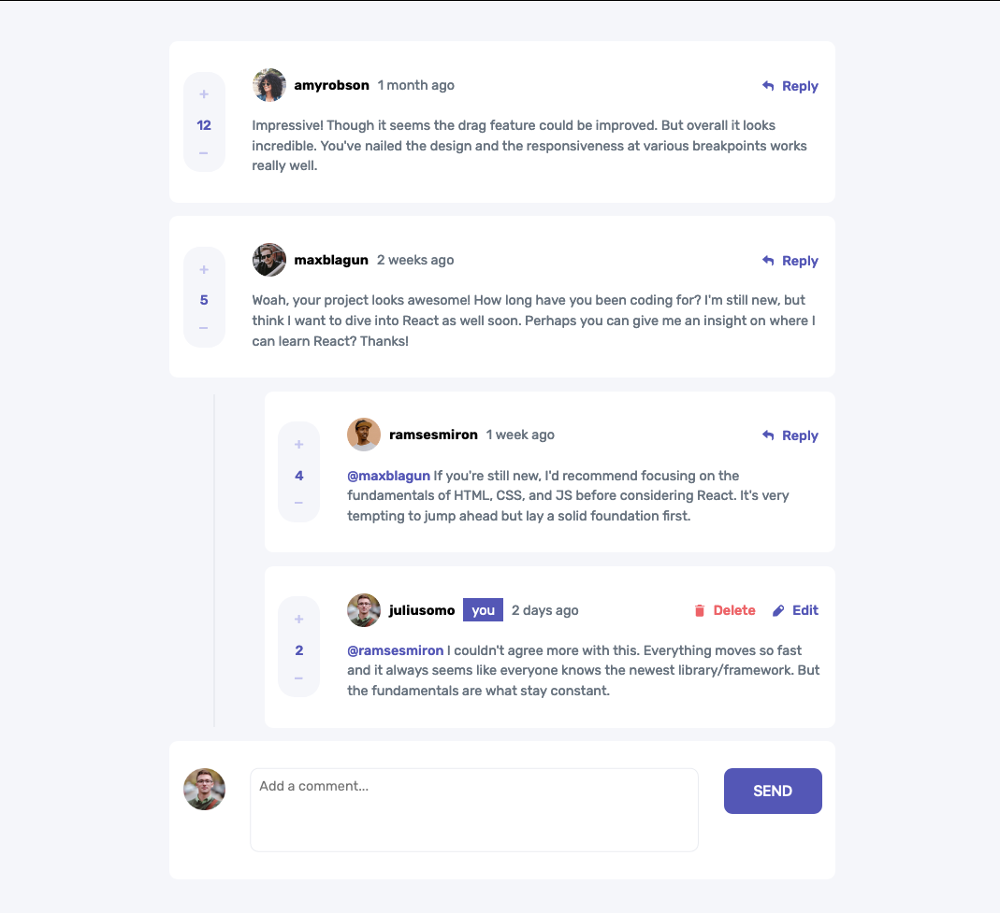

### The Project

Building an interactive comments section. The data is provided inside of a local 'data.json' file.

Users should be able to:

- View the optimal layout for the app depending on their device's screen size
- See hover states for all interactive elements on the page
- Create, Read, Update, and Delete comments and replies
- Upvote and downvote comments but only by 1 value
- **Bonus**: Instead of using the `createdAt` strings from the `data.json` file, try using timestamps and dynamically track the time since the comment or reply was posted.

### Screenshot

### Links

- Live Site URL: [Interactive Comments Page](https://interactive-comments-page-pjts8aifn-kylecapelli.vercel.app/)

## My process

### Built with

- Semantic HTML5 markup
- CSS custom properties
- Flexbox
- CSS Grid
- [React](https://reactjs.org/) - JS library

### What I learned

- Retrieving data from a JSON file and rendering it on the browser
- Manipulating data and updating the webpage with this new data
- How to create, read, update and delete comments and replies
- How to upvote and downvote comments
- Adjusting the layout of the landing page 
- React hooks (useEffect, useState)
- Creating a confirmation modal
- Creating conditionals so that the current user can only edit or delete their own comments and replies

### Continued development

- I believe I could have broken this project down into smaller components so that there isn't so much code in one file.
  - This would make it look a lot neater also
- I need to do a bit more research on the correct way to implement react hooks as I noticed that some of the pages are being rendered twice
  - This could be because I am trying to send data from a child to a parent which becomes difficult to track when the page re-renders
- I will try to plan out the project a bit better and spend more time on actually figuring out what components will go where.

Overall I am happy with the look of this landing page. The code could definitely be cleaned up and this comes down to my pre-planning in the initial stages of the project. In the future I will try to focus on all of these issues.

## Author

- LinkedIn - [Kyle Capelli](https://www.linkedin.com/in/kyle-capelli-aaa037166/)
